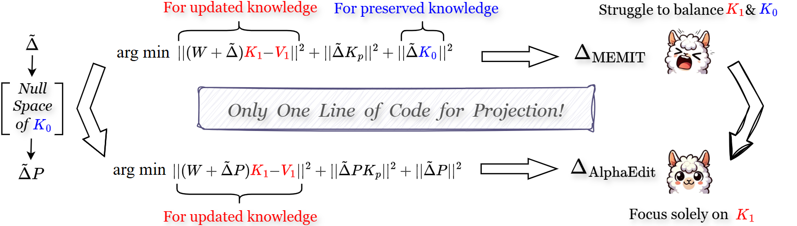

# AlphaEdit
- Code for [``AlphaEdit: Null-Space Constrained Knowledge Editing for Language Models``] **(ICLR 2025 Outstanding Paper)**

- AlphaEdit minimizes disruption to the preserved knowledge by projecting parameter perturbations onto the null space of its key matrices. It then removes the output error related to it from the current objective, allowing the model to focus solely on knowledge update without trade-off.  By leveraging the mathematical properties of matrix projection and null space, AlphaEdit ensures that the distribution of hidden representations within LLMs remains invariant after edits. This invariance allows post-edited LLMs to effectively handle both knowledge update and preservation simultaneously.
- AlphaEdit focuses on optimizing sequential editing from an objective standpoint. Additionally, we highly recommend our complementary work, [NSE](https://arxiv.org/abs/2410.04045), for readers interested in sequential editing. NSE enhances the process by optimizing both the retrieval of \(z\) values and the updating of weights \(W\), providing seamless integration with AlphaEdit.


*Figure: This is the overall architecture of our AlphaEdit method.*

## Requirements
**At least one A40 48G GPU.**

- torch==2.6.0
- einops==0.8.1
- higher==0.2.1
- hydra-core==1.3.2
- transformers==4.51.3
- datasets==2.21.0
- matplotlib==3.10.3
- spacy==3.4.1
- scipy==1.15.2
- scikit-learn==1.6.1
- nltk==3.9.1

We directly provide the "cov" matrix of Llama3-8B-instruct that we have already calculated. [https://drive.google.com/file/d/1GhDb4vPd1NIyRCbbIlgXV45xbE2UQMav/view?usp=sharing](https://drive.google.com/file/d/1rAeGBJccEaZYFpPMlD5tb5TNjkaUqwq6/view?usp=drive_link)
After decompressing it and saving it to the "./data/stats" folder.
## Quick Start
### An example for editing Llama3 (8B) on counterfact dataset using AlphaEdit
#### 1. Edit Llama3 (8B) model 
 
    CUDA_VISIBLE_DEVICES=7 nohup python3 -u -m experiments.evaluate   --alg_name AlphaEdit   --model_name meta-llama/Meta-Llama-3-8B-Instruct   --hparams_fname Llama3-8B.json   --ds_name mcf --dataset_size_limit 2000   --num_edits 1 --downstream_eval_steps 5 --forgetting_eval_interval 100   > /work/xinyu/Project/logs/llama3_8B_alphaedit_100edits_0908_woodbury.log 2>&1 &

This command runs an evaluation script for the AlphaEdit algorithm using the Llama3-8b-instruct. Below are the explanations for each argument:

- `--alg_name=AlphaEdit`: Specifies the name of the algorithm being used, which is AlphaEdit in this case.
- `--model_name=meta-llama/Meta-Llama-3-8B-Instruct`: Indicates the name of the model being evaluated, here it is Llama-3-8B-Instruct.
- `--hparams_fname=Llama3-8B.json`: Points to the JSON file containing hyperparameters specific to the Llama-3-8B-Instruct model.
- `--ds_name=mcf`: Specifies the dataset name, in this case, "mcf".
- `--dataset_size_limit=2000`: Sets the total number of editing samples to 2000.
- `--num_edits=100`: Defines the batch size for each round of editing, meaning 100 edits will be performed in each batch. 
- `--downstream_eval_steps=5`: indicates that a test of general capabilities is conducted after every 5 rounds of editing.

Results from each run are stored at `results/<method_name>/run_<run_id>` in a specific format:
```bash
results/
|__ AlphaEdit/
    |__ run_<run_id>/
        |__ params.json
        |__ case_0.json
        |__ case_1.json
        |__ ...
        |__ case_2000.json
```

#### 2. Summarize the results  
To summarize the results, you can use [`experiments/summarize.py`](experiments/summarize.py):

    python -m experiments.summarize --dir_name AlphaEdit --runs run_050

## Acknowledgment
Our code is based on  [``MEMIT``](https://github.com/kmeng01/memit.git) and [``EMMET``](https://github.com/scalable-model-editing/unified-model-editing.git).


# ==== 基本配置 ====
NUM_EDITS=10
ROOT="/work/xinyu/Project"
LOG_DIR="$ROOT/logs"
CKPT_SUBDIR="checkpoints_gpt2xl_ne${NUM_EDITS}"

# 确保目录存在 & 进入工程根目录（相对路径的 results 会落在 /work 盘）
install -d "$LOG_DIR"
cd "$ROOT"

# 日志 & PID（带 num_edits 前缀）
LOG="${LOG_DIR}/gpt2xl_ne${NUM_EDITS}_alphaedit_run_$(date +%m%d_%H%M).log"
PIDF="${LOG}.pid"

# ==== 启动 ====
CUDA_VISIBLE_DEVICES=6 nohup python3 -u -m experiments.evaluate \
  --alg_name AlphaEdit \
  --model_name meta-llama/Meta-Llama-3-8B-Instruct \
  --hparams_fname Llama3-8B.json \
  --ds_name mcf \
  --dataset_size_limit 2000 \
  --num_edits "$NUM_EDITS" \
  --downstream_eval_steps 0 \
  --save_every 100 \
  --checkpoint_subdir "$CKPT_SUBDIR" \
  > "$LOG" 2>&1 & echo $! | tee "$PIDF"


CUDA_VISIBLE_DEVICES=5 nohup python3 -u -m experiments.evaluate \
  --alg_name AlphaEdit \
  --model_name EleutherAI/gpt-j-6b \
  --hparams_fname EleutherAI_gpt-j-6B.json \
  --ds_name mcf --dataset_size_limit 2000 \
  --num_edits 10 --downstream_eval_steps 5 --forgetting_eval_interval 100 \
  > /home/xinyu/work/xinyu/Project/logs/gptj_ours25edits_0909_woodbury.log 2>&1 &


CUDA_VISIBLE_DEVICES=4 nohup python3 -u -m experiments.evaluate \
  --alg_name AlphaEdit \
  --model_name gpt2-xl \
  --hparams_fname gpt2-xl.json \
  --ds_name mcf --dataset_size_limit 2000 \
  --num_edits 10 --downstream_eval_steps 5 --forgetting_eval_interval 100 \ &


# Evaluating Edited Models
RUN_DIR="/work/xinyu/Project/results/AlphaEdit/run_092"

# 可选：确保从仓库根启动（能 import experiments）
cd /work/xinyu/Project

RUN_DIR="/work/xinyu/Project/results/AlphaEdit/run_085"
cd /work/xinyu/Project

CUDA_VISIBLE_DEVICES=5 nohup python3 -u -m experiments.eval_run_checkpoints \
  --run_dir "$RUN_DIR" \
  --ds_name mcf \
  --dataset_size_limit 2000 \
  --generation_test_interval 5 \
  --trust_remote_code \
  --skip_existing \
  > "$RUN_DIR/eval_batch_$(date +%m%d_%H%M).log" 2>&1 & echo $! | tee "$RUN_DIR/eval_batch.pid"


python3 -u experiments/plot_forgetting.py \
  --run_dir /work/xinyu/Project/results/AlphaEdit/run_090 \
  --ds_name mcf
